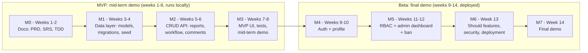

# VulnDesk: Product Requirements Document (PRD)

Web Application Development | Solo project | [Your Name] | ID: [Your ID] | Version 1.0 | [Date]

VulnDesk is a web application where security researchers submit vulnerability reports, security analysts triage them through a status workflow, and administrators manage users and access. It is delivered in two releases: an **MVP** for the mid-term demo and a **Beta** for the final demo.

Related documents: [SRS](02-srs.md) | [TDD](03-tdd.md) | [README](../README.md)

---

## 1. Release Plan (MVP → Beta)

| | MVP | Beta |
|---|---|---|
| Demo | Mid-term demo (assumed end of week 8) | Final demo (week 14) |
| What is shown | Core report, workflow and comment features through the REST API and a basic React UI | Authentication, profile, roles and permission scopes (RBAC), admin dashboard, ban, security, deployment |
| Environment | Runs locally; seeded demo users; no login | Deployed on Vercel with Supabase PostgreSQL over HTTPS |
| Identity | Acting user chosen from seeded demo users (temporary) | Real accounts, JWT access tokens, refresh tokens |

### Roadmap

---

## 2. Problem Statement and Goals

A mid-sized software company receives security vulnerability reports from outside researchers and internal testers by email, chat and a shared spreadsheet. Reports get lost or duplicated, researchers rarely hear back, anyone with access to the shared inbox can read sensitive exploit details, and nobody can show who changed a report's severity or status.

| ID | Goal | Release | Target |
|---|---|---|---|
| G1 | One place for every report | MVP | 100% of new reports are submitted and tracked in VulnDesk |
| G2 | Traceable decisions | MVP | 100% of status changes stored with who, when, old and new value |
| G3 | Confidential by default | Beta | Zero successful cross-user report reads in the automated access tests |
| G4 | Timely first response | Beta | At least 90% of reports leave the New status within their deadline |
| G5 | Deliver on time | MVP and Beta | MVP shown at the mid-term demo; all Must features complete and tested by week 13 |

The targets are project assumptions, measured in testing and in the demos.

---

## 3. Target Users

| Role | Who they are | What they need | Available in |
|---|---|---|---|
| Researcher | External bug-bounty hunters and internal testers (about 285) | Submit a report easily and see what happened to it | MVP (demo user), Beta (real login) |
| Analyst | Security team members (about 12) | See all reports, set severity, move reports through the workflow, discuss with researchers | MVP (demo user), Beta (real login) |
| Admin | System administrators (about 3) | Manage accounts and roles, ban users, see how the process performs | MVP (read access only), Beta (full) |
| Visitor | Anyone not logged in | Register and log in | Beta |

VulnDesk has global roles only. There are no per-group roles.

---

## 4. Scope per Release

| | In scope | Out of scope |
|---|---|---|
| **MVP** | Report submission with submission policy; own reports list and edit; report list with filters; triage (severity, status); status history; comments and internal notes; seeded demo users; data layer with migrations; REST API with generated docs; basic React UI; run locally | Login, tokens, passwords, roles enforced by permissions, profile, dashboards, admin management, deployment |
| **Beta** | Registration, login, logout, token refresh, login lockout; profile; roles and permission scopes on every endpoint; admin user management and ban; admin dashboard statistics; role dashboards; overdue flag; reopen; security hardening; deployment | Email notification, audit log (After Beta) |
| **Never** | Automated vulnerability scanning, AI or machine learning, bounty or payment handling, file uploads, mobile apps | |

---

## 5. Feature List

| ID | Feature | Description | Roles | MoSCoW | Release |
|---|---|---|---|---|---|
| F-01 | Demo user selector (temporary) | Acting user picked from seeded users so ownership and workflow rules work before login exists; removed in Beta | Developer | Must | MVP |
| F-02 | Report submission | Title, description, component, steps to reproduce, proposed severity, with submission policy | Researcher | Must | MVP |
| F-03 | My reports | List, view and edit own reports while status is New | Researcher | Must | MVP |
| F-04 | Report list and search | All reports, filter by status, severity, component, date, keyword, with paging | Analyst, Admin | Must | MVP |
| F-05 | Triage workflow | Set final severity, move through status workflow, mark duplicates | Analyst | Must | MVP |
| F-06 | Status history | Append-only record of every status change | Analyst, Admin, Researcher (own) | Must | MVP |
| F-07 | Comments and internal notes | Public thread per report plus analyst-only notes | Researcher, Analyst | Must | MVP |
| F-08 | Registration, login, logout, refresh | Email and password; short-lived access token and rotating refresh token | All | Must | Beta |
| F-09 | Login lockout | Temporary lock after repeated failed logins | All | Must | Beta |
| F-10 | Roles and permission scopes (RBAC) | Scopes enforced on every endpoint; UI shows only permitted actions | All | Must | Beta |
| F-11 | User profile | View and edit profile, change password | All | Should | Beta |
| F-12 | Admin user management and ban | Create users, assign roles, ban and unban, soft delete | Admin | Must | Beta |
| F-13 | Admin dashboard statistics | Counts by status and severity, response times, on-time rate per analyst | Admin | Should | Beta |
| F-14 | Role dashboards | Researcher: own reports by status. Analyst: triage queue and overdue | Researcher, Analyst | Should | Beta |
| F-15 | Overdue flag | Mark New reports past their response deadline | Analyst, Admin | Should | Beta |
| F-16 | Reopen end states | Admin reopens Closed, Rejected or Duplicate reports | Admin | Should | Beta |
| F-17 | Deployment | Hosted on Vercel with Supabase PostgreSQL over HTTPS | Admin | Must | Beta |
| F-18 | Email notification | Notify researcher when status changes | Researcher | Could | After Beta |
| F-19 | Audit log | Admin-viewable log of logins, role changes, deletions | Admin | Could | After Beta |
| F-20 | Vulnerability scanning, AI features, payments, file uploads | Not part of this project | - | Won't | Never |

---

## 6. User Stories

### MVP

| ID | Story | Feature |
|---|---|---|
| US-01 | As a researcher, I want to submit a vulnerability report so that the security team can investigate it. | F-02 |
| US-02 | As a researcher, I want to see the status of my reports so that I know whether anyone is acting on them. | F-03 |
| US-03 | As a researcher, I want to edit my report while it is still New so that I can correct mistakes. | F-03 |
| US-04 | As a researcher or analyst, I want to comment on a report so that we can clarify details. | F-07 |
| US-05 | As an analyst, I want to filter all reports by status and severity so that I can work on the most urgent first. | F-04 |
| US-06 | As an analyst, I want to set the final severity and move a report through the workflow so that its state is always accurate. | F-05 |
| US-07 | As an analyst, I want to add internal notes so that the team can discuss a report without the researcher seeing them. | F-07 |
| US-08 | As an analyst or researcher, I want to see a report's status history so that I know who changed it and when. | F-06 |

### Beta

| ID | Story | Feature |
|---|---|---|
| US-09 | As a visitor, I want to register and log in so that I can use VulnDesk with my own account. | F-08 |
| US-10 | As a logged-in user, I want to stay signed in and be able to log out so that I do not retype my password constantly and can end my session safely. | F-08 |
| US-11 | As a user, I want to view my profile, change my name and change my password so that my account stays correct and secure. | F-11 |
| US-12 | As a user, I want to see and do only what my role allows so that sensitive reports stay confidential. | F-10 |
| US-13 | As an admin, I want to create accounts and assign roles so that every person has only the access they need. | F-12 |
| US-14 | As an admin, I want to ban, unban or delete an account so that I can stop misuse quickly. | F-12 |
| US-15 | As an analyst, I want overdue reports flagged so that I respond in time. | F-15 |
| US-16 | As an admin, I want to reopen a closed, rejected or duplicate report so that mistakes in triage can be corrected. | F-16 |
| US-17 | As a researcher or analyst, I want a dashboard for my role so that I see what needs attention. | F-14 |
| US-18 | As an admin, I want system statistics so that I can judge how well the process works. | F-13 |
| US-19 | As the company, I want repeated failed logins to lock an account temporarily so that password guessing is slowed down. | F-09 |
| US-20 | As an admin, I want the system deployed over HTTPS so that users can reach it safely. | F-17 |

### After Beta

| ID | Story | Feature |
|---|---|---|
| US-21 | As a researcher, I want an email when my report's status changes so that I do not need to keep checking. | F-18 |
| US-22 | As an admin, I want an audit log of sensitive actions so that I can investigate incidents. | F-19 |

---

## 7. Success Metrics

### MVP

| Metric | Target |
|---|---|
| MVP Must endpoints implemented and listed in `/api/docs` | 100% |
| Acceptance criteria for US-01 to US-08 passing in automated tests | 100% |
| Submission policy rules covered by tests (each rule passes and fails correctly) | 5 of 5 |
| Back-end service layer test coverage | At least 70% |
| Fresh clone runs locally by following the README | Within 10 minutes |
| Demo scenario (submit, triage, comment, close) completes without errors | Yes |

### Beta

| Metric | Target |
|---|---|
| Protected endpoints with at least one negative access test (wrong role, wrong owner, no token) | 100% |
| Successful cross-user report reads in access tests | 0 |
| Passwords stored as Argon2id hashes, no plain text anywhere | 100% |
| Account locked after 5 failed logins, verified by test | Yes |
| API requests answered within 2 seconds at 60 concurrent users | At least 95% |
| Test users who submit a first report within 5 minutes without help | At least 4 of 5 |
| Deployed over HTTPS and reachable from the public URL | Yes |
| Every functional requirement traces to a user story and an endpoint | 100% |

---

## 8. Milestones

| ID | Weeks | Release | Deliverables | Exit check |
|---|---|---|---|---|
| M0 | 1-2 | MVP | PRD, SRS, TDD, README merged to `main` | Documents reviewed and approved |
| M1 | 3-4 | MVP | Data layer: SQLModel models, Alembic migration, seed data, Supabase connection, health endpoint | Migration runs on an empty database; seed creates demo users |
| M2 | 5-6 | MVP | CRUD API: reports, submission policy, status workflow and history, comments, filters, with `/api/docs` | API tests pass |
| M3 | 7-8 | MVP | Basic React UI for reports, triage and comments; tests; local run instructions; **mid-term demo** | Demo scenario completes |
| M4 | 9-10 | Beta | Authentication and profile: register, login, logout, refresh, lockout, Argon2, profile page | Auth acceptance criteria pass |
| M5 | 11-12 | Beta | RBAC and scopes on every endpoint, admin user management, ban, admin dashboard statistics, reopen | Access matrix tests pass |
| M6 | 13 | Beta | Overdue flag, role dashboards (Should), security hardening, deployment to Vercel and Supabase, load test | Public URL works over HTTPS |
| M7 | 14 | Beta | Bug fixes, documentation update, **final demo** | Definition of done met |

Should items in M5 and M6 are dropped first if time runs short.

---

## 9. Constraints and Assumptions

- One student developer, about 20 hours a week for 14 weeks (280 hours).
- Back end: FastAPI and SQLModel. Front end: React with TypeScript (Vite). Database: Supabase PostgreSQL. Hosting: Vercel.
- Expected load: about 300 users, 150 new reports a month, up to 60 concurrent users at peak.
- The customer representative (the course instructor) is available once a week.

## 10. Risks and Open Questions

| Risk or question | Handling |
|---|---|
| Time shortage for one developer | Features ordered by MoSCoW and release; After Beta first, then Should items |
| Authentication and RBAC arrive late (weeks 9-11) | One `get_current_user` function exists from the MVP, so Beta swaps in tokens and scopes without changing endpoints |
| Access-control mistakes leak reports | Negative tests for every endpoint, run before deployment |
| Serverless hosting and database connections | Use Supabase's connection pooler and test deployment early in M6 |
| Response-deadline policy still being revised | Deadlines stored in one table, not in code |
| Should researchers see the analyst's reason for rejection? (open) | Decision needed before M2 |
