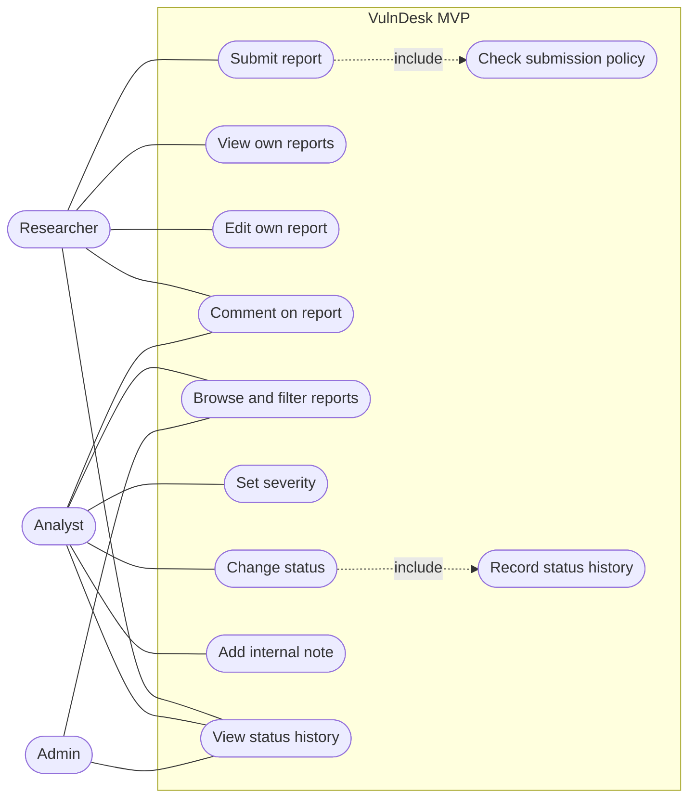
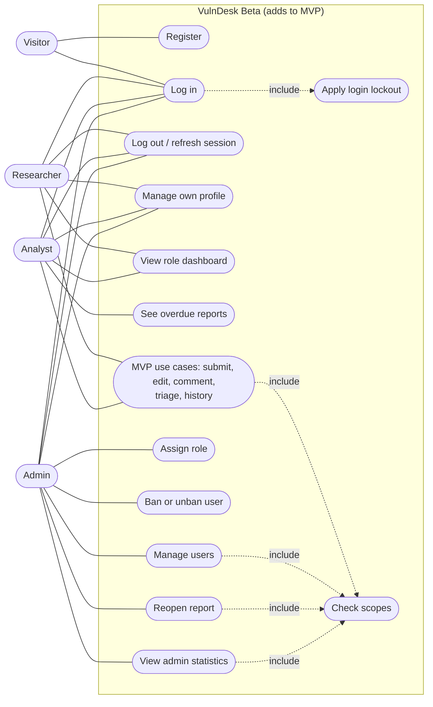
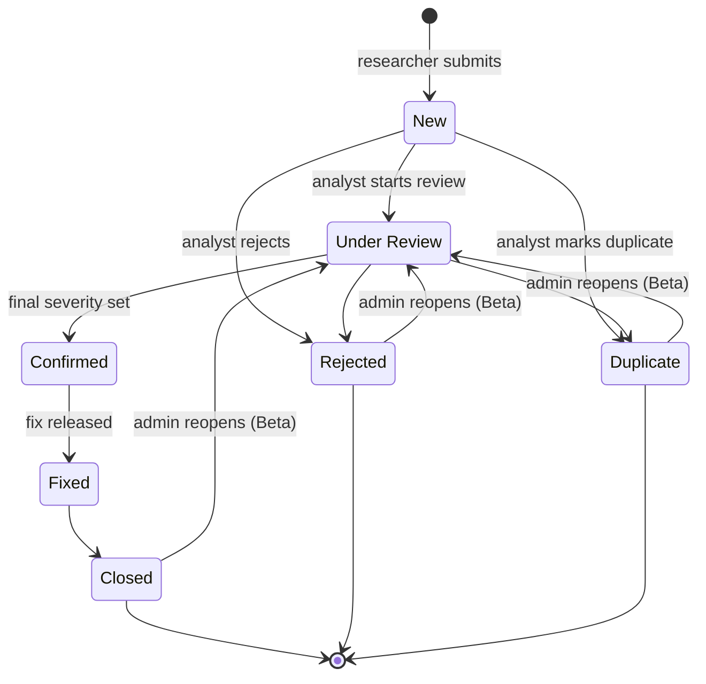

# VulnDesk: Software Requirements Specification (SRS)

Web Application Development | Solo project | [Your Name] | ID: [Your ID] | Version 1.0 | [Date]

Related documents: [PRD](01-prd.md) | [TDD](03-tdd.md) | [README](../README.md)

---

## 1. Purpose, Scope and Definitions

**Purpose.** This document states what VulnDesk must do, so that design, implementation and testing can be checked against it. Every requirement has an ID, a release (MVP or Beta) and a linked user story from the PRD.

**Scope.** VulnDesk is a web application where security researchers submit vulnerability reports, analysts triage them through a status workflow, and administrators manage users and access. It does not scan systems for vulnerabilities and does not process payments.

| Term | Meaning |
|---|---|
| CRUD | Create, Read, Update, Delete: the basic operations on a record |
| REST | An API style where resources have URLs and are handled with HTTP methods (GET, POST, PUT, PATCH, DELETE) |
| JWT | JSON Web Token: a signed token that proves who the caller is |
| Access token | Short-lived JWT sent with each API request |
| Refresh token | Longer-lived random token used only to obtain a new access token; stored hashed on the server and rotated on every use |
| RBAC | Role-based access control: each role is given a set of permissions |
| Scope | A named permission, for example `reports:triage`, checked on protected endpoints |
| Argon2id | The password-hashing algorithm used to store passwords |
| Report | A vulnerability report submitted by a researcher |
| Internal note | A comment visible only to analysts |
| End state | A report status that finishes the workflow: Closed, Rejected or Duplicate |
| Ban | An admin action that blocks a user from logging in or using the API, while keeping their data |
| MVP, Beta | The two releases: mid-term demo (local, no login) and final demo (login, RBAC, deployed) |
| MoSCoW | Priority: Must, Should, Could, Won't |

---

## 2. Roles

**Global roles** (each user has exactly one):

| Role | Description | Release |
|---|---|---|
| `researcher` | Submits reports and follows their own reports | MVP (demo user), Beta |
| `analyst` | Triages all reports and writes internal notes | MVP (demo user), Beta |
| `admin` | Manages users and roles, bans users, reopens reports, sees statistics | MVP (read only), Beta |

A visitor (not logged in) can only register and log in (Beta).

**Per-group roles:** none. VulnDesk has no groups. Access depends only on the global role and, for researchers, on whether they own the record.

In the MVP the acting user is a seeded demo user chosen with the `X-Demo-User` header (allowed only when `DEMO_MODE` is on). Ownership and workflow rules apply; permission scopes are enforced from the Beta.

---

## 3. Use Case Diagrams

### MVP

### Beta

---

## 4. Report State Diagram

| From | To | Who | Condition | Release |
|---|---|---|---|---|
| New | Under Review, Rejected, Duplicate | Analyst | Duplicate needs `duplicate_of_id` of an existing report | MVP |
| Under Review | Confirmed, Rejected, Duplicate | Analyst | Confirmed needs a final severity | MVP |
| Confirmed | Fixed | Analyst | - | MVP |
| Fixed | Closed | Analyst | - | MVP |
| Closed, Rejected, Duplicate | Under Review | Admin | - | Beta |

---

## 5. Functional Requirements

| ID | Requirement | MoSCoW | Release | Story |
|---|---|---|---|---|
| **Reports** | | | | |
| FR-07 | A researcher can submit a report with title, description, affected component, steps to reproduce and proposed severity. The new report has status New. | Must | MVP | US-01 |
| FR-08 | A submission is accepted only if the submission policy holds: title 5 to 120 characters, description 50 to 5,000 characters, fewer than 5 open reports (New or Under Review), account not banned, fewer than 3 reports rejected as invalid in the current calendar month. Otherwise the submission is rejected with the specific reason. | Must | MVP | US-01 |
| FR-09 | A researcher can list and view their own reports and nobody else's. | Must | MVP | US-02 |
| FR-10 | A researcher can edit their own report only while its status is New. | Must | MVP | US-03 |
| FR-11 | An analyst or admin can list all reports, filter by status, severity, component, date range and title keyword, with paging. | Must | MVP | US-05 |
| FR-12 | An analyst can assign a final severity (low, medium, high, critical). | Must | MVP | US-06 |
| FR-13 | An analyst can change a report's status only along the allowed transitions (section 4); any other transition is rejected. | Must | MVP | US-06 |
| FR-14 | A report cannot be set to Confirmed without a final severity. A report set to Duplicate must reference an existing, different report. | Must | MVP | US-06 |
| FR-15 | Every status change is stored with who made it, when, the old status and the new status, in the same transaction as the change. The history can be read but never edited or deleted. | Must | MVP | US-08 |
| **Comments** | | | | |
| FR-18 | A researcher can comment on their own reports and an analyst on any report. | Must | MVP | US-04 |
| FR-19 | An analyst can add an internal note that only analysts can see. | Must | MVP | US-07 |
| FR-20 | Comments are listed oldest first. A researcher sees only non-internal comments on their own reports. | Must | MVP | US-04, US-07 |
| **MVP identity** | | | | |
| FR-30 | In the MVP, the acting user is identified by the `X-Demo-User` header, accepted only when `DEMO_MODE` is on. In the Beta this is replaced by FR-02. | Must | MVP | US-01 to US-08 |
| **Accounts and access** | | | | |
| FR-01 | A visitor can register as a researcher with name, email and password. The email must be unique (case-insensitive). | Must | Beta | US-09 |
| FR-02 | A user can log in with email and password and receives a 15-minute access token and a 7-day refresh token. A failed login returns 401 without saying whether the email or the password was wrong. | Must | Beta | US-09 |
| FR-28 | A user can obtain a new access token with a valid refresh token (the old refresh token is then invalid) and can log out, which revokes the refresh token. | Must | Beta | US-10 |
| FR-29 | After 5 consecutive failed logins an account is locked for 15 minutes. While locked, even the correct password is refused with the same generic 401. | Must | Beta | US-19 |
| FR-03 | A user can view their profile, change their name and change their password (current password required). Changing the password revokes all refresh tokens. | Should | Beta | US-11 |
| FR-04 | An admin can create a user account with any role. | Must | Beta | US-13 |
| FR-05 | An admin can ban, unban and delete (soft delete) accounts. A banned user cannot log in or use the API, and their reports and comments remain. | Must | Beta | US-14 |
| FR-06 | An admin can change a user's role, but cannot change, ban or delete their own account. | Must | Beta | US-13 |
| FR-24 | Every protected endpoint checks the caller's scopes on the server. A missing or invalid token returns 401; a valid token without the needed scope returns 403. | Must | Beta | US-12 |
| FR-25 | The interface shows only the menus and actions the user's scopes allow. (A convenience; the server remains the authority.) | Must | Beta | US-12 |
| **Workflow extras and dashboards** | | | | |
| FR-16 | An admin can reopen a report in an end state; it returns to Under Review. | Should | Beta | US-16 |
| FR-17 | A New report past its response deadline (1, 2, 5 or 10 days for critical, high, medium or low proposed severity) is marked overdue. | Should | Beta | US-15 |
| FR-21 | A researcher's dashboard shows the count of their own reports by status. | Should | Beta | US-17 |
| FR-22 | An analyst's dashboard shows reports awaiting triage and overdue reports. | Should | Beta | US-17 |
| FR-23 | An admin's statistics show report counts by status and severity, average time to first response, on-time rate per analyst, and reports per researcher per month. | Should | Beta | US-18 |
| **After Beta** | | | | |
| FR-26 | The system emails the researcher when the status of their report changes. | Could | After Beta | US-21 |
| FR-27 | The system records an audit log of logins, role changes and deletions, viewable by admins. | Could | After Beta | US-22 |

---

## 6. Non-Functional Requirements

| ID | Category | Requirement and target | Verification | Release |
|---|---|---|---|---|
| NFR-01 | Performance | 95% of API requests complete within 2 seconds with 60 concurrent users | Load test (Locust) | Beta |
| NFR-02 | Performance | A report submission is confirmed within 3 seconds at 60 concurrent users | Load test, submission scenario | Beta |
| NFR-03 | Availability | At least 99.5% per month (at most 216 minutes of downtime in a 30-day month) | Uptime monitor log | Beta |
| NFR-04 | Security | Passwords are stored only as Argon2id hashes | Code review and database inspection | Beta |
| NFR-05 | Security | Every protected endpoint has at least one automated negative access test; none lets a user read another user's report | Automated test suite | Beta |
| NFR-06 | Security | All traffic uses HTTPS (TLS 1.2 or higher) | TLS scan of the deployed site | Beta |
| NFR-07 | Security | All input is validated on the server; the OWASP Top 10 checklist shows no open high-risk item | Checklist review and injection and script test cases | MVP |
| NFR-08 | Security | Data integrity: a status change and its history entry are saved in one transaction; no API can update or delete a history entry | Automated test and API review | MVP |
| NFR-09 | Security | Access tokens last at most 15 minutes; refresh tokens are stored only as hashes and rotated on every use; secrets are never committed to Git | Code review and repository scan | Beta |
| NFR-10 | Usability | At least 4 of 5 test users submit a first report within 5 minutes without help | Usability test with 5 volunteers | Beta |
| NFR-11 | Usability | Works on the latest two versions of Chrome, Firefox and Edge, from 360 px screen width | Manual cross-browser check | Beta |
| NFR-12 | Maintainability | Linter reports zero errors; automated tests cover at least 70% of the service layer | Linter and coverage report | MVP |
| NFR-13 | Maintainability | 100% of endpoints appear in the generated API docs at `/api/docs` with request and response examples; the PRD, SRS and TDD stay consistent with the code | Review of the docs page | MVP |

---

## 7. Validation Rules and Status Codes

### Validation rules

| Field | Rule | Release |
|---|---|---|
| `title` | Required, 5 to 120 characters | MVP |
| `description` | Required, 50 to 5,000 characters | MVP |
| `component` | Required, 1 to 100 characters | MVP |
| `steps_to_reproduce` | Required, 10 to 5,000 characters | MVP |
| `proposed_severity`, `final_severity` | One of `low`, `medium`, `high`, `critical` | MVP |
| `status` | One of the status values in section 4 | MVP |
| `duplicate_of_id` | Required when status is Duplicate; must be an existing report other than itself | MVP |
| Comment `body` | Required, 1 to 2,000 characters | MVP |
| Comment `is_internal` | May be true only for analysts | MVP |
| List filters | `page` at least 1; `page_size` 1 to 100 (default 20); dates in ISO 8601 | MVP |
| `name` | Required, 1 to 80 characters | Beta |
| `email` | Valid format, at most 254 characters, unique ignoring case | Beta |
| `password` | 8 to 128 characters with at least one letter and one digit | Beta |
| `role` | One of `researcher`, `analyst`, `admin` | Beta |

### Status codes

| Code | Meaning | Used when |
|---|---|---|
| 200 | OK | Successful read or update |
| 201 | Created | A record was created |
| 204 | No content | Successful delete or logout |
| 401 | Unauthorized | Missing, invalid or expired token; failed or locked login; banned user |
| 403 | Forbidden | Valid token without the required scope |
| 404 | Not found | Record does not exist, or belongs to another user (existence is not revealed) |
| 409 | Conflict | A business rule is violated: submission policy, invalid status transition, editing a report that is no longer New, changing your own role |
| 422 | Unprocessable entity | A field breaks a validation rule |
| 500 | Server error | Unexpected error; the response never contains internals |

---

## 8. Beta Permission Matrix (role × action)

"Own" means only records the user owns. "-" means not allowed (403, or 404 for another user's record).

| Action | Visitor | Researcher | Analyst | Admin | Scope |
|---|---|---|---|---|---|
| Register, log in | Yes | - | - | - | public |
| Refresh token, log out, view and edit own profile | - | Yes | Yes | Yes | any logged-in user |
| Submit report | - | Yes | - | - | `reports:create` |
| View reports | - | Own | All | All | `reports:read_own`, `reports:read_all` |
| Edit report while New | - | Own | - | - | `reports:update_own` |
| Set severity, change status | - | - | Yes | - | `reports:triage` |
| Reopen end-state report | - | - | - | Yes | `reports:reopen` |
| View status history | - | Own reports | All | All | same as viewing the report |
| Add comment | - | Own reports | Yes | - | `comments:create` |
| Read comments (non-internal) | - | Own reports | Yes | Yes | `comments:read` |
| Add and read internal notes | - | - | Yes | - | `comments:internal` |
| List and view users | - | - | - | Yes | `users:read` |
| Create, edit, delete users | - | - | - | Yes | `users:manage` |
| Ban and unban users | - | - | - | Yes | `users:manage` |
| Change a user's role | - | - | - | Yes (not own) | `roles:assign` |
| Own dashboard | - | Yes | Yes | Yes | any logged-in user |
| Admin statistics | - | - | - | Yes | `stats:read` |
| Audit log (After Beta) | - | - | - | Yes | `audit:read` |

---

## 9. Acceptance Criteria (Given / When / Then)

| ID | Story | Requirement | Given | When | Then |
|---|---|---|---|---|---|
| AC-01 | US-01 | FR-07, FR-08 | A researcher with 2 open reports | They submit a valid report | 201; the report has status New and is owned by them |
| AC-02 | US-01 | FR-08 | A researcher with 5 open reports | They submit another report | 409 with the reason "open report limit reached"; nothing is saved |
| AC-03 | US-01 | FR-08 | A form with a 3-character title | The researcher submits it | 422 naming the `title` field |
| AC-04 | US-02 | FR-09 | Reports from researchers A and B | A lists reports, then requests one of B's reports by id | Only A's reports are listed; B's report returns 404 |
| AC-05 | US-03 | FR-10 | A researcher's own report with status Under Review | They try to edit it | 409; the report is unchanged |
| AC-06 | US-06 | FR-13 | A report with status New | An analyst sets status Fixed | 409; status stays New |
| AC-07 | US-06 | FR-14 | A report without a final severity | An analyst sets status Confirmed | 409 with reason "final severity required" |
| AC-08 | US-06, US-08 | FR-13, FR-15 | A report with status New | An analyst sets Under Review | 200; a history row (New to Under Review, analyst, time) is saved in the same transaction |
| AC-09 | US-07 | FR-19, FR-20 | An internal note on a report | The report's owner lists its comments | The internal note is not in the list |
| AC-10 | US-09 | FR-02 | A registered user | They log in with the correct password | 200 with an access token and an HttpOnly refresh cookie |
| AC-11 | US-09 | FR-02 | A registered user | They log in with a wrong password | 401 with a generic message |
| AC-12 | US-19 | FR-29 | 5 consecutive failed logins for one account | The 6th attempt uses the correct password within 15 minutes | 401 and no tokens are issued |
| AC-13 | US-10 | FR-28 | An expired access token and a valid refresh token | The client calls refresh | A new access token is returned and the old refresh token no longer works |
| AC-14 | US-12 | FR-24 | A researcher's valid token | They change a report's status | 403 |
| AC-15 | US-12 | FR-24 | No token | A client lists reports | 401 |
| AC-16 | US-14 | FR-05 | A banned user with an unexpired access token | They call any endpoint or try to log in | 401 in both cases |
| AC-17 | US-13 | FR-06 | An admin | They change their own role | 409 |
| AC-18 | US-16 | FR-16 | A Closed report | An analyst, then an admin, try to reopen it | The analyst gets 403; the admin gets 200, status Under Review, and a history row |
| AC-19 | US-15 | FR-17 | A New report with proposed severity high, created 3 days ago | An analyst lists reports | That report is flagged overdue |
| AC-20 | US-18 | FR-23 | An admin and a researcher | Both call the statistics endpoint | The admin gets 200 with the statistics; the researcher gets 403 |
| AC-21 | US-11 | FR-03 | A logged-in user | They change their password with a wrong current password | 422; the password is unchanged |

---

## 10. Traceability: Story → Requirement → Endpoint

Endpoints are under `/api/v1`. Full endpoint tables are in the [TDD](03-tdd.md).

| Story | Release | Requirements | Endpoints |
|---|---|---|---|
| US-01 | MVP | FR-07, FR-08, FR-30 | `POST /reports` |
| US-02 | MVP | FR-09 | `GET /reports`, `GET /reports/{id}` |
| US-03 | MVP | FR-10 | `PUT /reports/{id}` |
| US-04 | MVP | FR-18, FR-20 | `POST /reports/{id}/comments`, `GET /reports/{id}/comments` |
| US-05 | MVP | FR-11 | `GET /reports` |
| US-06 | MVP | FR-12, FR-13, FR-14 | `PATCH /reports/{id}/severity`, `PATCH /reports/{id}/status` |
| US-07 | MVP | FR-19, FR-20 | `POST /reports/{id}/comments` (internal), `GET /reports/{id}/comments` |
| US-08 | MVP | FR-15 | `GET /reports/{id}/history` |
| US-09 | Beta | FR-01, FR-02 | `POST /auth/register`, `POST /auth/login` |
| US-10 | Beta | FR-28 | `POST /auth/refresh`, `POST /auth/logout` |
| US-11 | Beta | FR-03 | `GET /users/me`, `PATCH /users/me`, `PUT /users/me/password` |
| US-12 | Beta | FR-24, FR-25 | Every protected endpoint (scope dependency); `GET /users/me` supplies scopes to the UI |
| US-13 | Beta | FR-04, FR-06 | `GET /users`, `POST /users`, `PATCH /users/{id}/role` |
| US-14 | Beta | FR-05 | `POST /users/{id}/ban`, `POST /users/{id}/unban`, `DELETE /users/{id}` |
| US-15 | Beta | FR-17 | `GET /reports` (overdue field) |
| US-16 | Beta | FR-16 | `POST /reports/{id}/reopen` |
| US-17 | Beta | FR-21, FR-22 | `GET /dashboard` |
| US-18 | Beta | FR-23 | `GET /admin/stats` |
| US-19 | Beta | FR-29 | `POST /auth/login` |
| US-20 | Beta | NFR-03, NFR-06 | `GET /health` (deployment check) |
| US-21 | After Beta | FR-26 | None (runs when a status changes) |
| US-22 | After Beta | FR-27 | `GET /audit-logs` |
