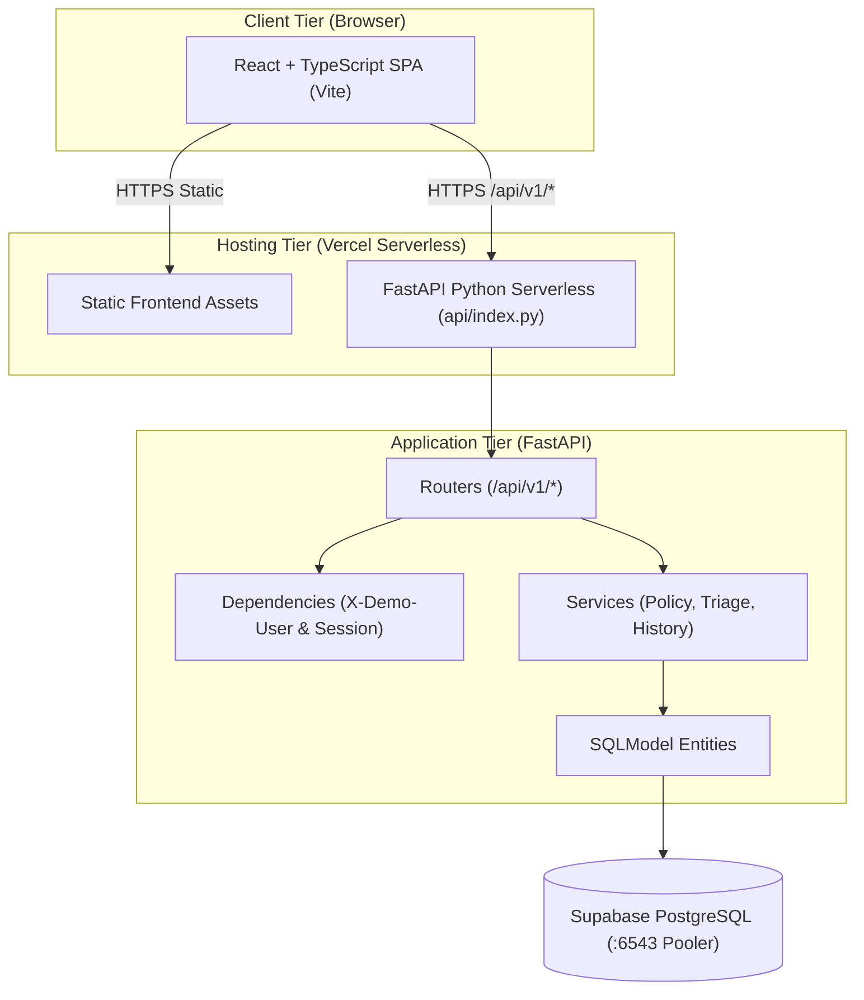

## 1. System Architecture

VulnDesk follows a three-tier architecture deployed on **Vercel** with a managed **Supabase PostgreSQL** database:

```mermaid
flowchart TB
    subgraph Client["Client Tier (Browser)"]
        UI["React + TypeScript SPA (Vite)"]
    end
    subgraph Vercel["Hosting Tier (Vercel Serverless)"]
        STATIC["Static Frontend Assets"]
        FN["FastAPI Python Serverless (api/index.py)"]
    end
    subgraph Backend["Application Tier (FastAPI)"]
        ROUTERS["Routers (/api/v1/*)"]
        DEPS["Dependencies (X-Demo-User & Session)"]
        SERVICES["Services (Policy, Triage, History)"]
        MODELS["SQLModel Entities"]
    end
    DB[("Supabase PostgreSQL (:6543 Pooler)")]

    UI -->|HTTPS Static| STATIC
    UI -->|HTTPS /api/v1/*| FN
    FN --> ROUTERS
    ROUTERS --> DEPS
    ROUTERS --> SERVICES
    SERVICES --> MODELS
    MODELS --> DB
```
